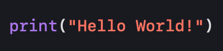

  

<h1 align="center">Hi 👋, I'm Roman</h1>
<h3 align="center">I am Junior QA Automation Python from Lviv, Ukraine 🇺🇦</h3>
  
- 🤝 I’m looking for a **Trainee/Junior QA Automation Python** position

<h3 align="left">Connect with me:</h3>

<h3 align="left">Codewars:</h3>

<h3 align="left">Languages and Tools:</h3>

<ul>
  <li>
    **QA Automation:**
    <li>
      
      
      
      
      
      
    </li>
  </li>
  
  <li>
    **Python Ecosystem:**
    <li>
      
      
      
      
      
    </li>
  </li>
  
  <li>
    **Tools:**
    <li>
      
      
      
      
    </li>
  </li>
  
  <li>
    **Web Development:**
    <li>
      
      
      
      
      
      
    </li>
  </li>
</ul>

